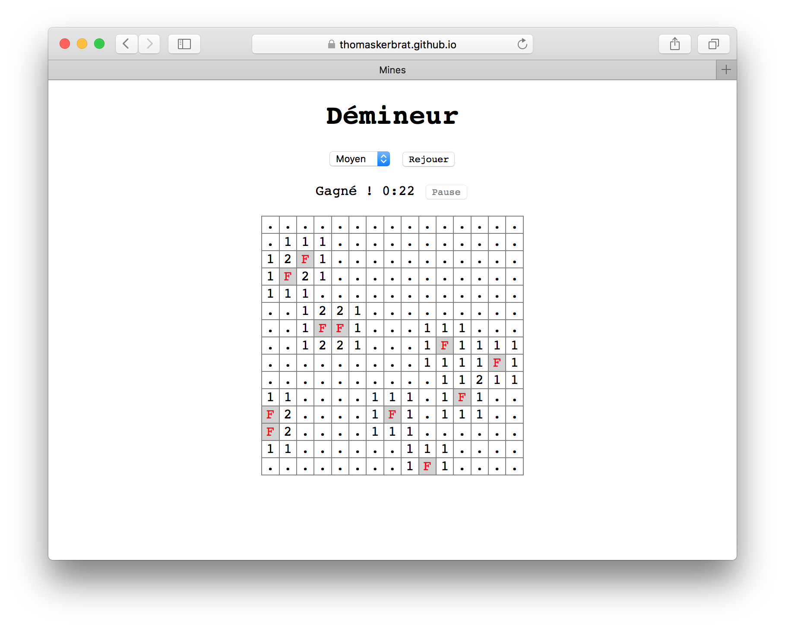

# Mines game

This is a bare implementation of a Mines game with the JavaScript's DOM API.
The solution is comprised of an `app.js` that contains the DOM manipulation,
a `grid.js` that contains an abstraction for a Mines Grid,
and a `timer.js` that contains an abstraction for a stopwatch.

If you wish to launch the game, clone the repository and open the `index.html` in any browser.

```bash
$ git clone https://github.com/ThomasKerbrat/mines
$ open index.html
```

You can also access this repository GitHub Pages: [thomaskerbrat.github.io/mines](https://thomaskerbrat.github.io/mines)

This is what it should look like when you finished a game :


